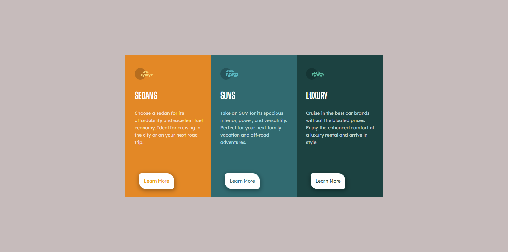

# Frontend Mentor - 3-column preview card component solution

This is a solution to the [3-column preview card component challenge on Frontend Mentor](https://www.frontendmentor.io/challenges/3column-preview-card-component-pH92eAR2-). Frontend Mentor challenges help you improve your coding skills by building realistic projects.

## Table of contents

- [Overview](#overview)
  - [The challenge](#the-challenge)
  - [Screenshot](#screenshot)
  - [Links](#links)
- [My process](#my-process)
  - [Built with](#built-with)
  - [What I learned](#what-i-learned)
  - [Useful resources](#useful-resources)
- [Author](#author)
- [Acknowledgments](#acknowledgments)

## Overview

### The challenge

Users should be able to:

- View the optimal layout depending on their device's screen size
- See hover states for interactive elements

### Screenshot

### Links

- Solution URL: [3-column preview card component solution](https://your-solution-url.com)
- Live Site URL: [3-column preview card component site](https://chimerical-horse-d97a60.netlify.app/)

## My process

### Built with

- Semantic HTML5 markup
- CSS custom properties
- Flexbox
- Desktop-first workflow

### What I learned

the project wasn't that hard really enjoyed it.
ps:i added my own shape in the "learn more" link.

### Useful resources

- [Awesome Screenshot and Screen Recorder](https://chrome.google.com/webstore/detail/awesome-screenshot-and-sc/nlipoenfbbikpbjkfpfillcgkoblgpmj) - excellent webpage screenshot extension for google chrome .
- [w3schools](https://www.w3schools.com/) - a very good site if you ever get lost.

## Author

- Frontend Mentor - [@anaschaouki](https://www.frontendmentor.io/profile/anaschaouki)

## Acknowledgments

I would like to give a big Thank you to anyone who helped by providing feedback on my solution.
